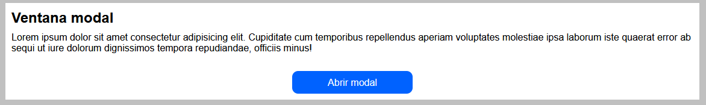
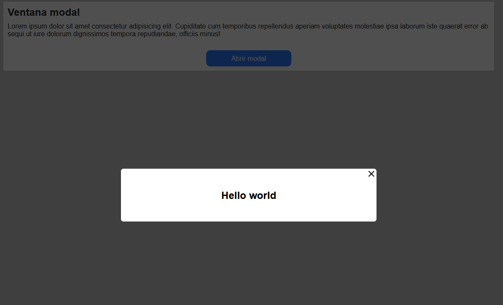

# VentanaModal

This is a js project based on opening a modal window.

---

## Table of contents

- [Description](#description)
- [Technologies](#technologies)
- [Installation](#installation)

## Description

This is a js project based on opening a modal window. Whenever you click the open button, the modal window will open and when you click the close button, the modal window will close

## Technologies

The project has been created with:

- HTML
- CSS
- JS

## Installation

To run this project, we need the following steps:

- Download the Live Server extension, which is found in the vscode editor

- Once the extension is downloaded, run the extension and everything will work correctly

- If you get an error, try running the application normally using the index.html file
